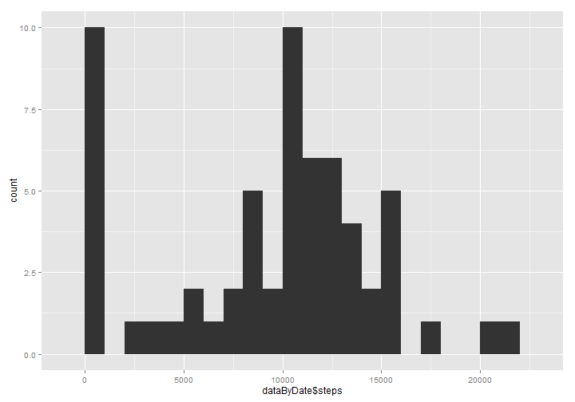
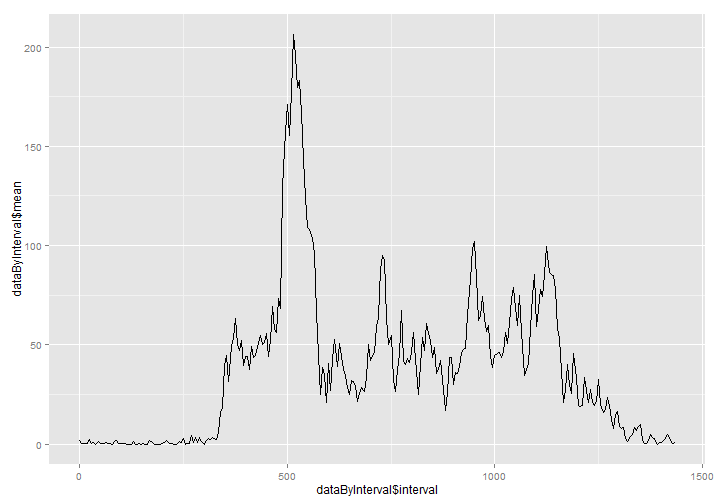
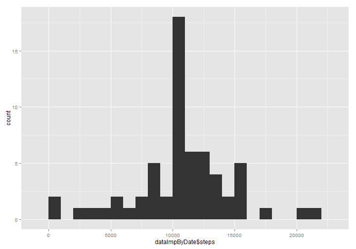
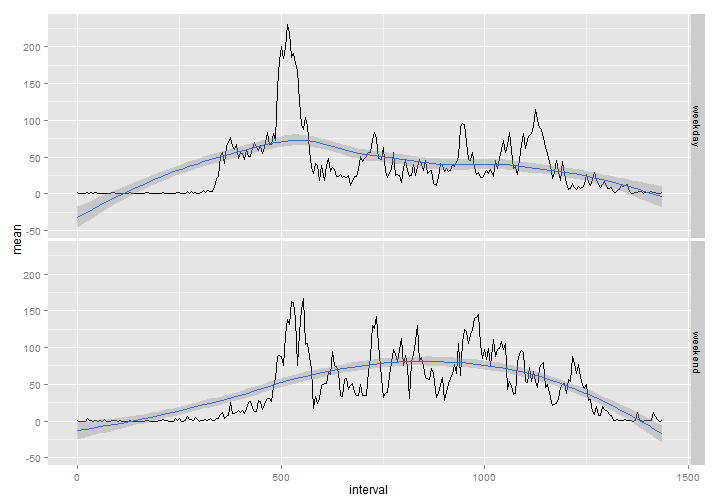

# Reproducible Research: Peer Assessment 1


## Loading and preprocessing the data

We start by decompressing the ZIP file, loading the embedded CSV file with appropriate column classes, and transforming the interval column from an ID to an actual minute-of-day figure.


```r
setwd("~/R/Coursera/Reproducible Research/PA1/RepData_PeerAssessment1")
baseFileName <- "activity"
expansionDir <- paste0(tempdir(), "\\", baseFileName)
unzip(paste0(baseFileName, ".zip"), exdir = expansionDir)
data <- read.csv(paste0(expansionDir, "\\", baseFileName, ".csv"), 
                 colClasses = c("integer","Date","integer"))
data$interval <- (data$interval %% 100) + 60 * (data$interval %/% 100)
summary(data)
```

```
##      steps            date               interval   
##  Min.   :  0.0   Min.   :2012-10-01   Min.   :   0  
##  1st Qu.:  0.0   1st Qu.:2012-10-16   1st Qu.: 359  
##  Median :  0.0   Median :2012-10-31   Median : 718  
##  Mean   : 37.4   Mean   :2012-10-31   Mean   : 718  
##  3rd Qu.: 12.0   3rd Qu.:2012-11-15   3rd Qu.:1076  
##  Max.   :806.0   Max.   :2012-11-30   Max.   :1435  
##  NA's   :2304
```

## What is mean total number of steps taken per day?

To answer this question, we compute the sum of steps by date and plot a histogram of the resulting figures.


```r
library(plyr)
dataByDate <- ddply(data, "date", function(g) c(steps = sum(g$steps, na.rm = T)))
library(ggplot2)
qplot(dataByDate$steps, binwidth = 1000)
```

 

The following figures summarize the level of activity per day.


```r
mean(dataByDate$steps, na.rm = T)
```

```
## [1] 9354
```

```r
median(dataByDate$steps, na.rm = T)
```

```
## [1] 10395
```

## What is the average daily activity pattern?

We visualize the average daily activity pattern by aggregating the average steps for each interval across all days and plotting it as a time series.


```r
dataByInterval <- ddply(data, "interval", function(g) c(mean = mean(g$steps, na.rm = T)))
qplot(dataByInterval$interval, dataByInterval$mean, geom = "line")
```

 

With the aforementioned aggregation, we can readily compute the interval that contains the maximum number of steps on average across all days in the dataset.


```r
dataByInterval[which.max(dataByInterval$mean),]
```

```
##     interval  mean
## 104      515 206.2
```

## Imputing missing values

The dataset contains thousands of missing values for the steps variable, but none for the other variables.


```r
sapply(names(data), function(n) sum(is.na(data[,n])))
```

```
##    steps     date interval 
##     2304        0        0
```

We impute missing values of the steps variable using the mean across all days of the corresponding interval.


```r
impute <- function(r) {
     if (is.na(r$steps)) {
         match <- subset(dataByInterval, interval == r$interval)
         round(match$mean)
     }
     else {
         r$steps
     }
}
dataImp <- data
dataImp$steps <- sapply(1:nrow(data), function(i) impute(data[i,]))
```

We visualize the imputed data with a histogram of the total steps taken each day.  


```r
dataImpByDate <- ddply(dataImp, "date", function(g) c(steps = sum(g$steps)))
qplot(dataImpByDate$steps, binwidth = 1000)
```

 

We summarize the data by reporting the mean & median of those per-day totals.  In doing so, we learn that these summary statistics differ from the pre-imputation estimates.  Specificially, both are greater than the previous estimates, suggesting that imputation has shifted upward the distribution of total daily number of steps.


```r
mean(dataImpByDate$steps)
```

```
## [1] 10766
```

```r
median(dataImpByDate$steps)
```

```
## [1] 10762
```

## Are there differences in activity patterns between weekdays and weekends?

In order to analyze difference in activity patterns between weekdays & weekends, we add a new factor variable indicating the type of day.


```r
isWeekend <- weekdays(dataImp$date) %in% c("Saturday", "Sunday")
dataImp$dayType <- factor(c("weekday", "weekend")[as.integer(isWeekend) + 1])
```

Using this new variable, we produce a panel plot showing the average number of steps by interval across weekdays & weekend days.


```r
dataImpByInterval <- ddply(dataImp, c("interval", "dayType"), function(g) c(mean = mean(g$steps)))
qplot(interval, mean, data = dataImpByInterval, geom = c("line", "smooth"), facets = dayType ~ ., method = "loess")
```

 

This plot helps demonstrate the subtle differences in activity pattern between weekdays & weekend days.
